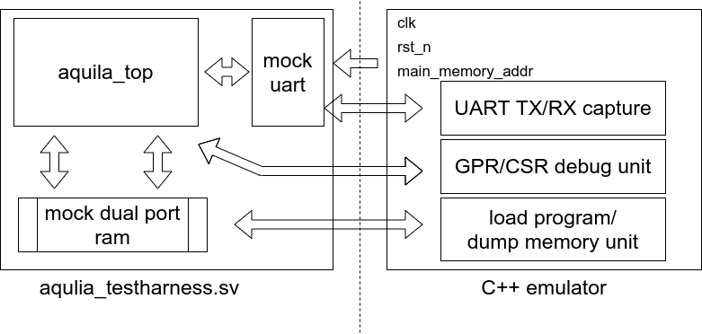

# Verilator
## folder structure
```
.
├── core-ver-src
├── full-ver-src
├── Makefile
├── riscv-isa-sim
├── tools
├── ver-test
├── ci
└── ver-test-bug
```
* core-ver-src
    + aquila_top as DUT
* full-ver-src
    + deprecated
* riscv-isa-sim
    + provide fesvr/elf.h for sim_mem.cpp
    + fesvr
* tools
    + log_proccess tool
* ver-test
    + simple test program
* ci
	+ test script
	+ auto build toolchain script
	+ testcase list 
## usage
Go and get the [RISCV gnu toolchain](https://github.com/riscv/riscv-gnu-toolchain) and configure with soft float point support.

In *ver-test* folder,build test program by makefile,make sure that your gcc version is 8.2.0 with soft float point and rv32im support,it will create _test.o which is rv32 executable binary and test.objdump for debug purpose:
```bash
$ make all
```

In *veriate* folder,build the verilator model of Aquila by using the Makefile:
```bash
$ make core_verilate
```
To lint check only:
```bash
$ make core_lint
```
To build verilator model of Aquila library only:
```bash
$ make core_versyn
```
After `make core_verilate` or `make core_versyn` command,it will create *core_obj_dir* which contain verilator generate library and executable binary.

To run verilator model, in *core_obj_dir* execute:
```bash
$ ./Vaquila_testharness [RISCV_TEST_ELF] [RVTEST(0/1),default 0]
```
For example:
```bash
$ ./Vaquila_testharness ../ver-test-bug/_test.o 0
```
If you want to run risc-tests. It will check tohost value and measure your test status:
```bash
$ ./Vaquila_testharness ../tmp/target/share/riscv-tests/isa/rv32ui-p-andi 1
```
It will print UART TX data to stdout, and generate aquila_core.vcd, cpu.log and dump.mem for debug.
You can use gtkwave to view waveform:
```bash
$ gtkwave aquila_core.vcd
```

To beautify cpu.log, in *tools* folder you can build and run *log_proccess* program to combine objdump file and cpu.log.
```bash
$ make log_proccess
$ ./log_proccess [OBJDUMP file] [LOG]
```
For example:
```bash
$ ./log_proccess ../ver-test-bug/test.objdump ../core_obj_dir/cpu.log
```
You can change `compress` boolean varible in log_proccess.cpp to generate cycle based log or instruction based log.
## verilator model advance usage
### Basic diagram

### code structure
* `aquila_testharness` is top module to connect `dp_ram` and`mock_uart` to `aquila_top`. 
* `aquila_core_tb.cpp` is C++ wrapper for this verilator model.
* `sim_mem.h` is header as elf file loader.
### parameter
* dp_ram.sv

| Name  | Description | limitation | default |
| -------- | -------- | -------- | ---------|
| MEM_SIZE | mock ddr main memory  size | verilator cannot synthesis large verilog array vector | 32'h200000 |
|ACCESS_LANTENCY|add latency to memory access to simulate real world scenario|bitwidth:8 bit|8'h50|
|MEM_OFFSET|memory offset,make main memory address similar to FPGA configuration|don't modify this parameter,see ip_repo/aquila/hdl/core_rtl/aquila_top.v for more information|32'h80000000|

*  mock_uart.sv

> :warning: **Current mock uart don't support RX**: Be very careful here!

| Name  | Description | limitation | default |
| -------- | -------- | -------- | ---------|
| AXI_LANTENCY | add latency to axi slave to simulate real world scenario | bitwidth:8 bit| 8'h0A| 
|UART_TX_FIFO_DELAY|UART TX transmit delay|bitwidth:8 bit,must greater than 1|8'h01|
|UART_RXFIFO_ADDR|memory map io register address for UART_RXFIFO|don't modify|32'hC0000000|
|UART_TXFIFO_ADDR|memory map io register address for UART_TXFIFO|don't modify|32'hC0000004|
|UART_STATUS_ADDR|memory map io register address for UART_STATUS|don't modify|32'hC0000008|
|TOHOST_VAL_ADDR|memory map io register address for fesvr "tohost" varible|don't modify|32'hC1000000|
## CI
Continuous Integration(CI) bases on Travis CI that run riscv-tests RISCV assembly tests. Travis CI runs these tests on Verilator. Travis CI builds riscv-gnu-toolchain, verilator model and run riscv-tests automatically.

Aquila CI test current only execute 2 case sets: riscv32um-p, riscv32ui-p.

There are two script in `ci` folder. One is `riscv_gcc_check.sh`. It can check whether riscv-gnu-toolchain exists on $RISCV path and builds it(optional). Another is `run_rv_test.sh`. It can check all dependency (except for riscv-gnu-toolchain) and execute riscv-tests set.
```bash
$ ./run_rv_test.sh [test case list] [create log(0/1) default is 1]
```
## TODO
* RISCV torture tests
* local CI runner (drone CI)
